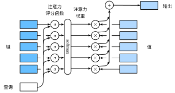

# Transformer

## 背景

### RNN的局限


上图是最基础的RNN的结构示意图。RNN（循环神经网络）包含两个重要的概念：时间步，隐藏状态。

时间步：比如，在文本处理任务中，每个时间步可能是一个单词或字符。

隐藏状态：它的作用就像是网络的“记忆”，它允许网络通过多个时间步学习数据中的时序关系。

第 $t$ 个时间步的输出 $y_t$ 既与当前时间步的输入  $x_t$ 有关，又与上一时间步的隐藏状态 $h_{t-1}$ 有关。

虽然RNN有很好的预测效果，但是它的计算非常昂贵，因为隐藏状态的设置导致它没有办法并行运算。这样的局限促进了我们今天的主角--**transformer**的产生。

## **Transformer 处理 "I arrived at the" → "Je suis arrivé" 的全过程**

Transformer 模型用于神经机器翻译（NMT），其核心流程包括 **词嵌入（Embeddings）**、**位置编码（Positional Encoding）**、**多头自注意力（Multi-head Self-Attention）**、**前馈网络（Feed-Forward Network）**，以及 **解码（Decoding）**。下面我们逐步解析 "I arrived at the" → "Je suis arrivé" 是如何通过 Transformer 翻译的。

---

## **1. 输入处理**
### **(1) Tokenization（分词）**
首先，Transformer 需要将句子拆分成**子词单元（subwords）**，通常使用 **Byte Pair Encoding (BPE)** 或 **WordPiece**。
```plaintext
Input: "I arrived at the"
Tokenized: ["I", "arrived", "at", "the"]
```

---

### **(2) 词嵌入（Word Embeddings）**
Transformer 不能直接处理文本，因此每个 token 需要转换成高维向量表示：
```plaintext
Embeddings(I)      → [0.1, 0.5, 0.8, ...]
Embeddings(arrived) → [0.3, 0.7, 0.2, ...]
Embeddings(at)      → [0.6, 0.1, 0.9, ...]
Embeddings(the)     → [0.2, 0.4, 0.7, ...]
```

---

### **(3) 位置编码（Positional Encoding）**
由于 Transformer 没有循环结构（不像 RNN 依赖时间步），它通过**正弦 & 余弦函数**添加位置信息：
```plaintext
PositionalEncoding(0) = [0.0000, 0.8415, ...]  # 对应 "I"
PositionalEncoding(1) = [0.0001, 0.9093, ...]  # 对应 "arrived"
PositionalEncoding(2) = [0.0002, 0.1411, ...]  # 对应 "at"
PositionalEncoding(3) = [0.0003, 0.7568, ...]  # 对应 "the"
```
然后，将它们加到 Embeddings 上，提供单词的位置信息。

---

## **2. 编码阶段（Encoder）**
Transformer 通过**多个注意力层**处理输入信息，每层主要包括：
- **多头自注意力（Multi-head Self-Attention）**
- **前馈神经网络（Feed-Forward Network）**
- **残差连接 & Layer Normalization**

---

### **(4) 多头自注意力（Self-Attention）**
**目标：让每个词关注整个句子的所有词（包括自身），以获取上下文信息。**

比如处理I在这个句子当中的作用，多头意味着每个头有不同的侧重，包括语法结构，语意信息等。

---

### **(5) 前馈神经网络（Feed-Forward Network）**
这是transformer引入非线性因素的关键，在这个子层中设置有激活函数（如relu）。

---

## **3. 解码阶段（Decoder）**
Decoder 结构与 Encoder 类似，但多了一层**交叉注意力（Cross-Attention）**，用于接收 Encoder 计算出的隐藏状态。这里的隐藏状态只关注了源语言内部的关系。

---

### **(6) 自注意力（Masked Self-Attention）**
Decoder 也使用自注意力，因为在翻译的过程中我们需要保持该句子的语法正确。这一要求意味着我们需要考虑目标语言的内部关系。

---

### **(7) 交叉注意力（Cross-Attention）**
Decoder 需要结合 Encoder 的信息来生成翻译：
- 让解码器关注源句子 `"I arrived at the"`，提取必要的信息：
  - 识别 `"arrived"` 应对应 `“arrivé”`。
  - 识别 `"I"` 应对应 `"je"`。
  - 注意性别和语法，使 `"arrivé"` 变为正确的 `“je suis arrivé”`。

---

## **4. 生成翻译**
Transformer 最后通过一个 **Softmax 层** 输出概率最高的法语单词：
```plaintext
P(Je | I) = 0.92
P(suis | arrived) = 0.87
P(arrivé | at) = 0.95
```
最终生成的法语翻译：
```plaintext
"Je suis arrivé"
```

---

# 注意力机制

## 查询、键和值

首先我将以搜索引擎为例来介绍一下这三个概念。

**查询**： 查询是用户在搜索引擎中输入的内容，通常是一个关键字或短语，表示用户想要查找的信息。

**键**： 键通常是指一个文档或网页的标识符（如网页的URL）、关键词。

**值**： 值是与键相关联的数据，是实际的查询结果。


比如你在搜索引擎中寻找深度学习相关的内容，它首先在一系列键中（不管是否和深度学习有关）寻找，最后通过你的查询和键的相互作用，返回一个相关性比较强的值（通常包括关键词深度学习，比如《动手学深度学习》）。


# 注意力汇聚：查询和键的相互租用

## 平均汇聚

先使用最简单的估计器来解决回归问题。
基于平均汇聚来计算所有训练样本输出值的平均值：

$$f(x) = \frac{1}{n}\sum_{i=1}^n y_i,$$

## [**非参数注意力汇聚**]

$$f(x) = \sum_{i=1}^n \alpha(x, x_i) y_i,$$

其中 $x$ 是查询， $(x_i, y_i)$ 是键值对。
比较这两个注意力汇聚公式，
注意力汇聚是 $y_i$ 的加权平均。
将查询 $x$ 和键 $x_i$ 之间的关系建模为
*注意力权重*（attention weight）$\alpha(x,x_i)$ ，
这个权重将被分配给每一个对应值 $y_i$ 。
对于任何查询，模型在所有键值对注意力权重都是一个有效的概率分布：
它们是非负的，并且总和为1。

为了更好地理解注意力汇聚，
下面考虑一个具体的函数，其定义为：

$$\begin{aligned} f(x) &=\sum_{i=1}^n \alpha(x, x_i) y_i\\ &= \sum_{i=1}^n \frac{\exp\left(-\frac{1}{2}(x - x_i)^2\right)}{\sum_{j=1}^n \exp\left(-\frac{1}{2}(x - x_j)^2\right)} y_i \\ &= \sum_{i=1}^n \mathrm{softmax}\left(-\frac{1}{2}(x - x_i)^2\right) y_i. \end{aligned}$$

在这个公式中，
如果一个键 $x_i$ 越是接近给定的查询 $x$ ，
那么分配给这个键对应值 $y_i$ 的注意力权重就会越大，
也就“获得了更多的注意力”。

## [**带参数注意力汇聚**]

我们可以将可学习的参数集成到注意力汇聚中。

在下面的查询 $x$ 和键 $x_i$ 之间的距离乘以可学习参数 $w$ ：

$$\begin{aligned}f(x) &= \sum_{i=1}^n \alpha(x, x_i) y_i \\ &= \sum_{i=1}^n \frac{\exp\left(-\frac{1}{2}((x - x_i)w)^2\right)}{\sum_{j=1}^n \exp\left(-\frac{1}{2}((x - x_j)w)^2\right)} y_i \\ &= \sum_{i=1}^n \mathrm{softmax}\left(-\frac{1}{2}((x - x_i)w)^2\right) y_i.\end{aligned}$$

# 注意力评分函数

*注意力评分函数*（attention scoring function），
简称*评分函数*（scoring function），
就像上面的
$$
a(x,xi) = \frac{1}{\sqrt{2\pi}} \exp(-\frac{1}{2}((x-xi)w)^2).
$$
为了方便理解，我们可以把方程改写为
$$
a(q,k) = \frac{1}{\sqrt{2\pi}} \exp(-\frac{1}{2}((q-k)w)^2).
$$
其中 $q$ 代表查询, $k$ 代表键。

然后把这个函数的输出结果输入到softmax函数中进行运算。
通过上述步骤，将得到与键对应的值的概率分布（即注意力权重）。
最后，注意力汇聚的输出就是基于这些注意力权重的值的加权和。

从宏观来看，上述算法可以用来实现
注意力机制框架。
下图说明了
如何将注意力汇聚的输出计算成为值的加权和，
其中 $a$ 表示注意力评分函数。
由于注意力权重是概率分布，
因此加权和其本质上是加权平均值。



用数学语言描述，假设有一个查询
$\mathbf{q} \in \mathbb{R}^q$ 和
$m$ 个“键－值”对
$(\mathbf{k}_1, \mathbf{v}_1), \ldots, (\mathbf{k}_m, \mathbf{v}_m)$，
其中 $\mathbf{k}_i \in \mathbb{R}^k$ , $\mathbf{v}_i \in \mathbb{R}^v$ 。 注意力汇聚函数 $f$ 就被表示成值的加权和：

$$
f(\mathbf{q}, (\mathbf{k}_1, \mathbf{v}_1), \ldots, (\mathbf{k}_m, \mathbf{v}_m)) = \sum_{i=1}^m \alpha(\mathbf{q}, \mathbf{k}_i) \mathbf{v}_i
$$
$$
\text{where the output lies in } \mathbb{R}^v
$$


其中查询 $\mathbf{q}$ 和键 $\mathbf{k}_i$ 的注意力权重（标量）
是通过注意力评分函数 $a$ 将两个向量映射成标量，
再经过softmax运算得到的：

$$
\alpha(\mathbf{q}, \mathbf{k}_i) = \mathrm{softmax}(a(\mathbf{q}, \mathbf{k}_i)) = \frac{\exp(a(\mathbf{q}, \mathbf{k}_i))}{\sum_{j=1}^m \exp(a(\mathbf{q}, \mathbf{k}_j))}
$$
$$
\text{where } \alpha(\mathbf{q}, \mathbf{k}_i) \in \mathbb{R}
$$

 
正如上图所示，选择不同的注意力评分函数 $a$ 会导致不同的注意力汇聚操作。
这里将介绍两个流行的评分函数，稍后将用他们来实现更复杂的注意力机制。

## [**加性注意力**]

一般来说，当查询和键是不同长度的矢量时，可以使用加性注意力作为评分函数。
给定查询 $\mathbf{q} \in \mathbb{R}^q$ 和
键 $\mathbf{k} \in \mathbb{R}^k$ ，
*加性注意力*（additive attention）的评分函数为

$$
a(\mathbf{q}, \mathbf{k}) = \mathbf{w}_v^\top \text{tanh}(\mathbf{W}_q \mathbf{q} + \mathbf{W}_k \mathbf{k})  \text{where } a(\mathbf{q}, \mathbf{k}) \in \mathbb{R}
$$

其中可学习的参数是 $\mathbf W_q\in\mathbb R^{h\times q}$ 、
 $\mathbf W_k\in\mathbb R^{h\times k}$ 和
$\mathbf w_v\in\mathbb R^{h}$ 。
如公式所示，
将查询和键连结起来后输入到一个多层感知机（MLP）中，
感知机包含一个隐藏层，其隐藏单元数是一个超参数 $h$ 。
通过使用 $\tanh$ 作为激活函数。

### 对注意力分数进行masked_softmax

#### [**掩蔽softmax操作**]

正如上面提到的，softmax操作用于输出一个概率分布作为注意力权重。
在某些情况下，并非所有的值都应该被纳入到注意力汇聚中。
例如，为了高效处理小批量数据集，
某些文本序列被填充了没有意义的特殊词元。
为了仅将有意义的词元作为值来获取注意力汇聚，
可以指定一个有效序列长度（即词元的个数），
以便在计算softmax时过滤掉超出指定范围的位置。
下面的`masked_softmax`函数
实现了这样的*掩蔽softmax操作*（masked softmax operation），
其中任何超出有效长度的位置都被掩蔽并置为0。

为了[**演示此函数是如何工作**]的，
考虑由 $2 \times 2 \times 4$ 张量表示的样本，
有效长度为 $[2,3]$
可以理解为 $[[2,2],[3,3]]$
经过掩蔽softmax操作，超出有效长度的值都被掩蔽为0。

掩蔽后张量：

    [[[0.488994  , 0.511006  , 0.        , 0.        ],
    [0.43654838, 0.56345165, 0.        , 0.        ]],

    [[0.28817102, 0.3519408 , 0.3598882 , 0.        ],
    [0.29034293, 0.25239873, 0.45725834, 0.        ]]]

同样，也可以使用二维张量，为矩阵样本中的每一行指定有效长度。

若有效长度为 $[[1,3],[2,4]]$ , 那么掩蔽后张量：

    [[[1.        , 0.        , 0.        , 0.        ],
    [0.35848376, 0.36588794, 0.2756283 , 0.        ]],

    [[0.54370314, 0.45629686, 0.        , 0.        ],
    [0.19598779, 0.25580424, 0.19916737, 0.34904057]]]

### 计算注意力汇聚函数

$$
f(\mathbf{q}, (\mathbf{k}_1, \mathbf{v}_1), \ldots, (\mathbf{k}_m, \mathbf{v}_m)) = \sum_{i=1}^m \alpha(\mathbf{q}, \mathbf{k}_i) \mathbf{v}_i \quad \text{where} \quad \mathbf{v}_i \in \mathbb{R}^v
$$


对于每一个批次，做value的加权求和。

## [**缩放点积注意力**]

使用点积可以得到计算效率更高的评分函数，
但是点积操作要求查询和键具有相同的长度 $d$ 。
假设查询和键的所有元素都是独立的随机变量，
并且都满足零均值和单位方差，
那么两个向量的点积的均值为 $0$ ，方差为 $d$ 。
为确保无论向量长度如何，
点积的方差在不考虑向量长度的情况下仍然是$1$，
我们再将点积除以 $\sqrt{d}$ ，
则*缩放点积注意力*（scaled dot-product attention）评分函数为：

$$a(\mathbf q, \mathbf k) = \mathbf{q}^\top \mathbf{k}  /\sqrt{d}.$$

在实践中，我们通常从小批量的角度来考虑提高效率，
例如基于 $n$ 个查询和 $m$ 个键－值对计算注意力，
其中查询和键的长度为 $d$ ，值的长度为 $v$ 。
查询 $\mathbf Q\in\mathbb R^{n\times d}$ 、
键 $\mathbf K\in\mathbb R^{m\times d}$ 和
值 $\mathbf V\in\mathbb R^{m\times v}$ 的缩放点积注意力是：

$$ \mathrm{softmax}\left(\frac{\mathbf Q \mathbf K^\top }{\sqrt{d}}\right) \mathbf V \in \mathbb{R}^{n\times v}.$$

与加性注意力演示相同，由于键包含的是相同的元素，
而这些元素无法通过任何查询进行区分，因此会获得[**均匀的注意力权重**]。

# 多头注意力

在实践中，当给定相同的查询、键和值的集合时，
我们希望模型可以基于相同的注意力机制学习到不同的行为，
然后将不同的行为作为知识组合起来，
捕获序列内各种范围的依赖关系
（例如，短距离依赖和长距离依赖关系）。


为此，与其只使用单独一个注意力汇聚，
我们可以用独立学习得到的 $h$ 组不同的
*线性投影*（linear projections）来变换查询、键和值。
然后，这 $h$ 组变换后的查询、键和值将并行地送到注意力汇聚中。
最后，将这 $h$ 个注意力汇聚的输出拼接在一起，
并且通过另一个可以学习的线性投影进行变换，
以产生最终输出。
这种设计被称为*多头注意力*（multihead attention）。
对于 $h$ 个注意力汇聚输出，每一个注意力汇聚都被称作一个*头*（head）。
下图展示了使用全连接层来实现可学习的线性变换的多头注意力。


## 数学模型

在实现多头注意力之前，让我们用数学语言将这个模型形式化地描述出来。
给定查询 $\mathbf{q} \in \mathbb{R}^{d_q}$ 、
键 $\mathbf{k} \in \mathbb{R}^{d_k}$ 和
值 $\mathbf{v} \in \mathbb{R}^{d_v}$，
每个注意力头$\mathbf{h}_i$（$i = 1, \ldots, h$）的计算方法为：

$$\mathbf{h}_i = f(\mathbf W_i^{(q)}\mathbf q, \mathbf W_i^{(k)}\mathbf k,\mathbf W_i^{(v)}\mathbf v) \in \mathbb R^{p_v},$$

其中，可学习的参数包括
$\mathbf W_i^{(q)}\in\mathbb R^{p_q\times d_q}$、
$\mathbf W_i^{(k)}\in\mathbb R^{p_k\times d_k}$和
$\mathbf W_i^{(v)}\in\mathbb R^{p_v\times d_v}$，
以及代表注意力汇聚的函数 $f$ 。
$f$可以是
加性注意力和缩放点积注意力。
多头注意力的输出需要经过另一个线性转换，
它对应着 $h$ 个头连结后的结果，因此其可学习参数是
$\mathbf W_o\in\mathbb R^{p_o\times h p_v}$：

$$
\mathbf{W_o} \begin{bmatrix} 
\mathbf{h_1} \\ 
\vdots \\ 
\mathbf{h_h} 
\end{bmatrix} \in \mathbb{R}^{p_o}
$$


基于这种设计，每个头都可能会关注输入的不同部分，
可以表示比简单加权平均值更复杂的函数。

# [**自注意力**]

给定一个由词元组成的输入序列 $\mathbf{x}_1, \ldots, \mathbf{x}_n$ ，
其中任意 $\mathbf{x}_i \in \mathbb{R}^d$（$1 \leq i \leq n$） 。
该序列的自注意力输出为一个长度相同的序列
$\mathbf{y}_1, \ldots, \mathbf{y}_n$ ，其中：

$$\mathbf{y}_i = f(\mathbf{x}_i, (\mathbf{x}_1, \mathbf{x}_1), \ldots, (\mathbf{x}_n, \mathbf{x}_n)) \in \mathbb{R}^d$$

根据注意力汇聚函数 $f$ 。
对于一个翻译模型来说，
query是目标语言的一个词元，
而keys和values是相同的，都是源语言的所有单词，
通过f函数可以计算出与query匹配度最高的翻译。
